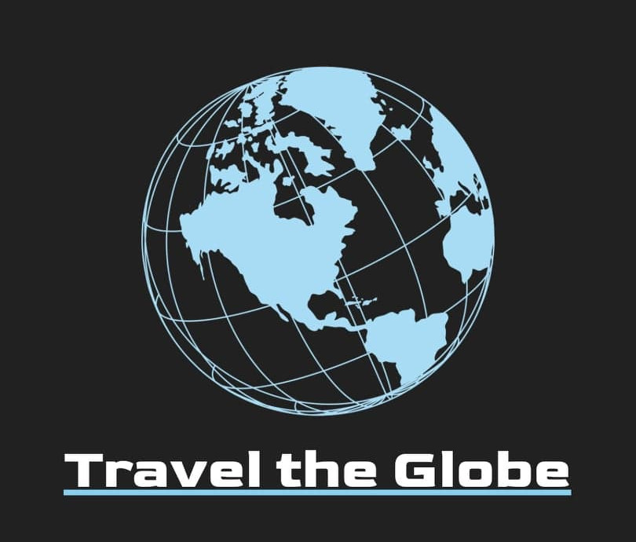
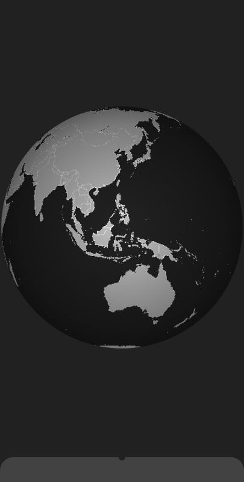
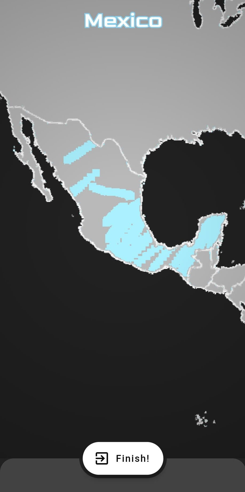
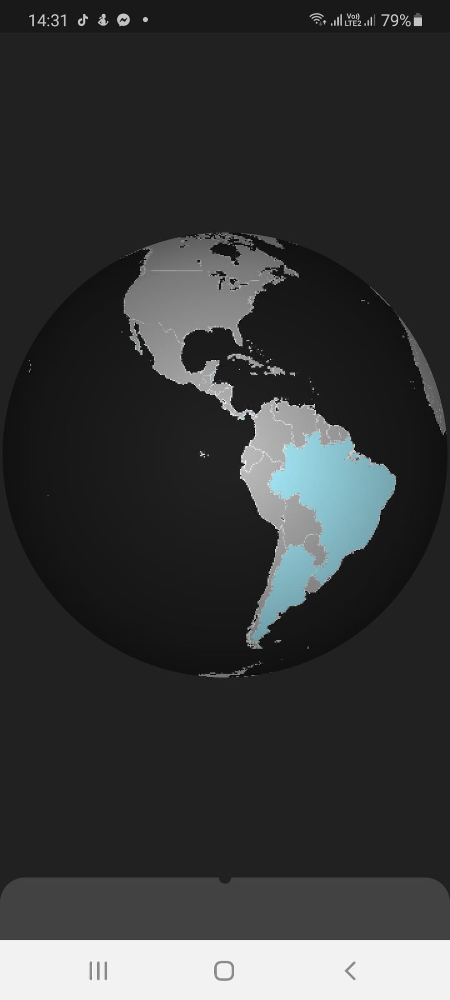

# Travel The Globe

**Travel The Globe** is a prototype of a 3 dimensional travel diary implemented with Flutter. The application is deeply dependent on Google's Firebase services.

## Usage and features
After authentication, the user can see a 3D globe textured with all the countries on Earth.

The basics concept is to scratch off the countries already visited. Double clicking on the country reverse geolocates the place clicked

After scratching down and pressing the **Finish** button, the country is saved to the database, becomes completed and colorized.

